<div align="justify">

# Modem Acústico

## Sumário

- [Introdução: Contexto e Necessidade](#introdução-contexto-e-necessidade)
- [Revisão da literatura](#revisão-da-literatura)
- [1. Tecnologias e Abordagens](#1-tecnologias-e-abordagens)
  - [1.1 Modulação](#11-modulação)
  - [1.2 Plataformas de Hardware](#12-plataformas-de-hardware)
  - [1.3 Protocolos e Eficiência Energética](#13-protocolos-e-eficiência-energética)
- [2. Limitações e Desafios](#2-limitações-e-desafios)
  - [2.1 Taxa de Dados (Throughput)](#21-taxa-de-dados-throughput)
  - [2.2 Alcance de Comunicação](#22-alcance-de-comunicação)
  - [2.3 Robustez em Ambientes Dinâmicos](#23-robustez-em-ambientes-dinâmicos)
  - [2.4 Limitações dos Transdutores](#24-limitações-dos-transdutores)
- [4. Exemplos e Desempenho](#4-exemplos-e-desempenho)
- [5. Materiais e Métodos](#5-materiais-e-métodos)
  - [5.1 Materiais](#5.1-materiais)
  - [5.2 Métodos](#5.2-métodos)
- [Microcontrolador](#microcontrolador)
- [Transmissor](#transmissor)
  - [1. Seleção e Caracterização do Transdutor Ultrassônico](#1-seleção-e-caracterização-do-transdutor-ultrassônico)
  - [2. Implementação da Modulação M-FSK no ESP32](#2-implementação-da-modulação-m-fsk-no-esp32)
  - [3. Projeto do Amplificador Classe D e Circuitos de Potência](#3-projeto-do-amplificador-classe-d-e-circuitos-de-potência)
  - [4. Filtro de saída sintonizado](#4-filtro-de-saída-sintonizado)
- [Receptor](#receptor)
  - [1. Condicionamento do Sinal Recebido](#1-condicionamento-do-sinal-recebido)
    - [1.1 Controle de ganho automático](#11-controle-de-ganho-automático)
  - [2. Amostragem e Demodulação Digital](#2-amostragem-e-demodulação-digital)
    - [2.1 Subamostragem](#21-subamostragem)
  - [7. Integração e Prototipagem](#7-integração-e-prototipagem)
  - [8. Testes Experimentais e Validação](#8-testes-experimentais-e-validação)
- [Resultados](#resultados)
- [Conclusão](#conclusão)
  - [Dificuldades encontradas](#dificuldades-encontradas)
  - [Sugestões para trabalhos futuros](#sugestões-para-trabalhos-futuros)
- [Referências](#referências)

---

## Lista de Figuras

- [Figura 1 – Diagrama do projeto proposto](#figura-1--diagrama-do-projeto-proposto)
- [Figura 2 – Transdutor Ultrassônico Utilizado no Projeto](#figura-2--transdutor-ultrassônico-utilizado-no-projeto)
- [Figura 3 – Função de transferência do transdutor ultrassônico](#figura-3--função-de-transferência-do-transdutor-ultrassônico)
- [Figura 4 – Etapas de um amplificador classe D](#figura-4--etapas-de-um-amplificador-classe-d)
- [Figura 5 – Resposta característica de um filtro LC passa-faixa](#figura-5--resposta-característica-de-um-filtro-lc-passa-faixa)
- [Figura 6 – Simulação filtro LC](#figura-6--simulação-filtro-lc)
- [Figura 7 – Potenciômetro Digital](#figura-7--potenciômetro-digital)
- [Figura 8 – Espectro subamostrado](#figura-8--espectro-subamostrado)

---

## Lista de Tabelas

- [Tabela 1 – Especificações Técnicas do Módulo Sensor Ultrassônico JSN-SR04T/AJ-SR04M](#tabela-1--especificações-técnicas-do-módulo-sensor-ultrassônico-jsn-sr04taj-sr04m)
- [Tabela 2 – Principais Características do ESP32](#tabela-2--principais-características-do-esp32)


## Introdução: Contexto e Necessidade

A comunicação subaquática enfrenta desafios devido à forte atenuação de ondas eletromagnéticas na água, tornando a comunicação acústica a principal solução para enlaces submersos de média e longa distância. Tradicionalmente, modems acústicos eram caros e consumiam muita energia, restringindo seu uso a setores militares ou offshore. Com o surgimento de sensores subaquáticos e veículos autônomos de baixo custo, bem como novas demandas civis (monitoramento ambiental, IoT subaquático), cresce a busca por soluções acessíveis e eficientes【Campagnaro et al., 2023】【Sánchez et al., 2012】.

Neste contexto, o presente projeto propõe o desenvolvimento de um modem digital ultrassônico baseado na plataforma ESP32, empregando a modulação M-FSK para transmissão e recepção de dados em ambiente aquático. O trabalho envolve desde a seleção e caracterização do transdutor, passando pela implementação do algoritmo de modulação e demodulação, até o desenvolvimento dos circuitos de amplificação, filtragem e condicionamento de sinal, culminando na integração de um sistema funcional.

## Revisão da literatura

## 1. Tecnologias e Abordagens

### 1.1 Modulação

A modulação FSK (Frequency Shift Keying) é predominante nos modems de baixo custo por sua simplicidade e robustez, embora tenha limitação de taxa de dados【Indriyanto et al., 2018】【Lee et al., 2014】【Renner et al., 2020】. Modulações alternativas, como PSK, MFSK, DSSS e OFDM, são empregadas para elevar taxas ou robustez em projetos mais avançados【Su et al., 2020】【Sherlock et al., 2022】【Chen et al., 2022】.

### 1.2 Plataformas de Hardware

A escolha de microcontroladores acessíveis, como STM32 (diversos modelos) e ARM Cortex, permite projetos compactos, de baixo custo e baixo consumo energético【Su et al., 2020】【Chen et al., 2022】【Sherlock et al., 2022】. Outra abordagem recorrente é a utilização de transdutores piezoelétricos baratos, inclusive sensores automotivos adaptados para uso subaquático【Indriyanto et al., 2018】【Campagnaro et al., 2023】【Renner et al., 2020】.

### 1.3 Protocolos e Eficiência Energética

Para otimizar o uso de energia, diversas estratégias são aplicadas: wake-up assíncrono, duty cycling e protocolos MAC adaptados (CSMA, TDMA). Modos sleep/wake ampliam a autonomia dos dispositivos, sendo essenciais em redes densas ou de longa duração【Sánchez et al., 2012】【Renner et al., 2020】. A avaliação do canal antes da transmissão (clear channel assessment) é outra solução presente em projetos recentes.
## 2. Limitações e Desafios

### 2.1 Taxa de Dados (Throughput)

Modems econômicos geralmente operam em taxas de 40 a 640 bps (em raros casos chegando a alguns kbps), o que é suficiente para telemetria básica, mas limita aplicações que demandam transmissão de grandes volumes de dados, como vídeo, áudio em tempo real ou controle de veículos em missões complexas.

Técnicas mais robustas de modulação, como MFSK, DSSS ou MOS, melhoram a resistência ao ruído e ao multi-caminho, mas normalmente sacrificam ainda mais a taxa de transmissão para manter a confiabilidade【Chen et al., 2022】【Sherlock et al., 2022】.

---

### 2.2 Alcance de Comunicação

O alcance típico para modems de baixo custo varia de poucos metros (caso de sensores ultrassônicos adaptados, como JSN-SR04T) até algumas centenas de metros (Ahoi, ITACA) e raramente ultrapassa 2 km sem aumento significativo do consumo ou do custo do transdutor【Chen et al., 2022】【Renner et al., 2020】【Sánchez et al., 2012】.

Limitações no alcance se devem ao baixo nível de potência dos transmissores (para preservar a bateria) e à baixa sensibilidade de transdutores de baixo custo.

---

### 2.3 Robustez em Ambientes Dinâmicos

**Multi-caminho:** Reflexões no fundo, superfície e obstáculos criam cópias defasadas do mesmo sinal, causando interferência intersimbólica, distorção do pacote e aumento do BER (Bit Error Rate). Isso se agrava em ambientes rasos ou próximos a estruturas, comuns em aplicações reais【Renner et al., 2020】.

**Variação temporal do canal:** Flutuações rápidas na qualidade do canal acústico ocorrem devido a correntes, bolhas, variação de temperatura e salinidade, afetando a atenuação e o desvio Doppler. Isso dificulta a sincronização, principalmente em modems com processamento limitado【Chen et al., 2022】【Renner et al., 2020】.

---

### 2.4 Limitações dos Transdutores

Transdutores de baixo custo, como piezoelétricos automotivos, apresentam eficiência reduzida de conversão e largura de banda limitada, além de maior sensibilidade à direção do sinal (direcionalidade), limitando o desempenho em ambientes complexos.

Projetos customizados conseguem reduzir custos, mas normalmente não atingem as especificações dos transdutores profissionais quanto a sensibilidade, robustez e faixa dinâmica.


# 4. Exemplos e Desempenho
| Nome do Modem / Artigo      | Referência                                                                                                                                     | Tecnologia / Modulação          | Alcance / Taxa de Dados               | Características e Observações                                                                                |
|-----------------------------|------------------------------------------------------------------------------------------------------------------------------------------------|----------------------------------|----------------------------------------|-------------------------------------------------------------------------------------------------------------|
| **ITACA**                   | Sánchez et al., 2012<br>*An Ultra-Low Power and Flexible Acoustic Modem Design to Develop Energy-Efficient Underwater Sensor Networks*          | FSK, 85 kHz                     | Até 240 m<br><0,1 W                    | Ultra-baixo consumo, uso de transdutor de echosounder, aplicação em sensores subaquáticos flexíveis.         |
| **JSN-SR04T FSK Modem**     | Indriyanto et al., 2018<br>*Ultrasonic Underwater Acoustic Modem Using Frequency Shift Keying (FSK) Modulation*                                 | FSK, 40/43 kHz                  | Até 1,5 m<br>1200 bps                   | Usa transdutor automotivo (JSN-SR04T), baixo BER, solução ultra econômica para curtas distâncias.            |
| **Micro-modem Korea**       | Lee et al., 2014<br>*Micro-Modem for Short-Range Underwater Communication Systems*                                                              | FSK/BPSK, 70 kHz                | Até 500 m<br>Até 5 kbps                 | Compacto, baixo custo e baixo consumo, voltado para ambientes rasos e confinados.                            |
| **Ahoi Modem**              | Renner et al., 2020<br>*ahoi: Inexpensive, Low-power Communication and Localization for Underwater Sensor Networks and μAUVs*                   | BFSK, 50-75 kHz                 | 150–200 m<br>260 bps (até 4,7 kbps)     | Projeto open-source, portátil (<$600), redundancy, frequency hopping, ideal para redes de sensores e μAUVs.  |
| **Nanomodem**               | Sherlock et al., 2022<br>*Ultra-Low-Cost and Ultra-Low-Power, Miniature Acoustic Modems Using Multipath Tolerant Spread-Spectrum Techniques*    | MOS, Spread-Spectrum, 24–32 kHz | Até 2 km<br>40 a 640 bps                | Muito compacto, baixo custo, baixo consumo, robustez a multi-caminho, uso em AUVs e swarms.                 |
| **STM32H743 modem**         | Su et al., 2020<br>*An general embedded underwater acoustic communication system based on advance STM32*                                       | FSK/OFDM, 21–27 kHz             | 5–8 km<br>100 bps a 1 kbps              | Plataforma flexível, uso de STM32H743, suporta múltiplas modulações, consumo otimizado.                     |
| **Micromodem Xiamen Univ.** | Chen et al., 2022<br>*Underwater Acoustic Micromodem for Underwater Internet of Things*                                                        | MFSK, 35–45 kHz                 | 500 m<br>200–300 bps                    | Baixo custo (~500 USD), consumo reduzido, voltado para aplicações de IoT subaquático.                       |


## 5 Materiais e Métodos

### 5.1 Materiais

### 5.2 Métodos

O desenvolvimento do modem digital para comunicação acústica subaquática será realizado em etapas integradas, visando garantir a viabilidade técnica e a robustez do sistema proposto. O projeto adota uma abordagem incremental, onde os principais blocos funcionais do sistema serão concebidos, testados e integrados de forma modular, permitindo ajustes conforme o andamento dos experimentos.


<p align="center"><b>Figura 1 – Diagrama do projeto proposto</b></p>


<p align="center"><b>Fonte: Aluno</b></p>

## Microcontrolador

O **ESP32** é um microcontrolador moderno desenvolvido pela Espressif Systems, amplamente utilizado em projetos de Internet das Coisas (IoT), automação, sistemas embarcados e prototipagem eletrônica. Ele se destaca por integrar um processador dual-core de 32 bits, memória RAM suficiente para aplicações de processamento de sinais, interfaces analógicas e digitais, além de conectividade Wi-Fi e Bluetooth, tudo em um único chip de baixo custo e consumo reduzido. No contexto deste projeto, o ESP32 foi escolhido devido à sua capacidade de realizar a aquisição, o processamento digital e o controle dos sinais necessários para a comunicação acústica, além de permitir fácil programação via Arduino IDE e ótima flexibilidade para integração de filtros digitais, algoritmos de demodulação e controle de periféricos como o potenciômetro digital, drivers de potência e módulos de comunicação.


<p align="center">
  <span style="display:inline-block; width:250px; text-align:center;">
    <b>Figura 1 – Legenda da primeira imagem</b>
  </span>
  <span style="display:inline-block; width:190px; text-align:center;">
    <b>Figura 2 – Legenda da segunda imagem</b>
  </span>
</p>
<p align="center">
  
  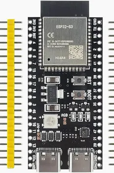
</p>


**PWM (Pulse Width Modulation)**  
O ESP32 oferece até 16 canais independentes de PWM, que podem ser atribuídos a quase qualquer pino digital do microcontrolador. O PWM permite a geração de sinais digitais modulados em largura de pulso, sendo fundamental para controle de motores, brilho de LEDs, geração de tons (sinais sonoros) e modulação de frequência (como em M-FSK). Os canais PWM do ESP32 são altamente configuráveis, permitindo a escolha da frequência de operação (desde alguns hertz até centenas de kilohertz), resolução do duty cycle (de 1 a 16 bits) e sincronização entre canais. Esse recurso é gerenciado internamente pelo hardware do microcontrolador, oferecendo alta precisão, baixa latência e baixo consumo de CPU para a geração de sinais periódicos ou modulação avançada.

**ADC (Analog to Digital Converter)**  
O ESP32 possui até 18 canais de ADC, com resolução de até 12 bits, capazes de converter sinais analógicos (variações de tensão) em valores digitais compreendidos entre 0 e 4095. Esses conversores permitem que o ESP32 adquira sinais de sensores, potenciômetros, microfones e outros dispositivos analógicos, tornando possível o monitoramento e processamento digital desses sinais em tempo real. A taxa máxima de amostragem pode chegar a 80 kHz, mas depende da configuração de software e de eventuais limitações de ruído e precisão. O ADC do ESP32 pode operar em modo de múltiplos canais (com multiplexação), possui referência interna ajustável e é essencial em aplicações de processamento de sinais, como filtros digitais, demodulação e análise espectral.
<p align="center"><b>Tabela 2 – Principais Características do ESP32</b></p>
<div align="center">


| Característica               | Descrição                                              |
|------------------------------|--------------------------------------------------------|
| Processador                  | Dual-core Tensilica LX6 32 bits                        |
| Frequência de clock          | Até 240 MHz                                            |
| Memória RAM                  | Até 520 KB interna                                    |
| Memória Flash                | Até 16 MB externa (dependendo do módulo)              |
| Wi-Fi                        | IEEE 802.11 b/g/n (2.4 GHz)                           |
| Bluetooth                    | Bluetooth 4.2 BR/EDR e BLE                            |
| ADC (Conversor A/D)          | Até 18 canais, resolução de 12 bits                   |
| DAC (Conversor D/A)          | 2 canais, resolução de 8 bits                         |
| PWM                          | Até 16 canais                                         |
| SPI/I2C/I2S/UART             | Múltiplas interfaces disponíveis                      |
| GPIOs                        | Até 34 pinos configuráveis                            |
| Alimentação                  | 2,2 V a 3,6 V (típico: 3,3 V)                         |
| Consumo de energia           | Baixo consumo, múltiplos modos de economia            |
| Temperatura de operação      | -40°C a +125°C                                        |

</div>

O ESP32 conta com o recurso de DMA (Direct Memory Access), que permite a transferência direta de dados entre periféricos e a memória RAM, sem a intervenção direta do processador principal. Isso é especialmente útil em aplicações que exigem aquisição de dados em alta velocidade, como leitura contínua do ADC, comunicação serial ou processamento de sinais digitais. Com o uso do DMA, é possível configurar buffers circulares para armazenar amostras do ADC de forma eficiente, liberando o processador para executar outras tarefas em paralelo e reduzindo o risco de perda de dados por estouro de buffer. Esse recurso proporciona maior desempenho, precisão e confiabilidade em projetos embarcados que demandam manipulação intensiva de dados, sendo uma das vantagens do ESP32 em relação a microcontroladores mais simples.


# Transmissor

### 1. Seleção e Caracterização do Transdutor Ultrassônico

A primeira etapa consiste na pesquisa, aquisição e caracterização do transdutor ultrassônico, elemento central para a conversão entre sinais elétricos e acústicos. Serão realizados testes experimentais para determinar a resposta em frequência do transdutor, permitindo a escolha das frequências de operação ideais para a modulação M-FSK, que se espera estar próxima de 40 kHz. 

Inicialmente, a ideia era adquirir um transdutor específico por meio de um site internacional, porém, constatou-se que esse fornecedor só realizava vendas em grandes quantidades. Em alternativa, buscou-se contato com outro fornecedor, mas não houve retorno aos questionamentos técnicos, como frequência de operação e potência suportada. Diante dessas limitações e para viabilizar o início dos experimentos, optou-se por utilizar o transdutor presente no módulo Sensor de Distância Ultrassônico JSN-SR04T Resistente a Água, facilitando assim o avanço do trabalho.

O sensor JSN-SR04T é baseado em um transdutor piezoelétrico, tecnologia amplamente empregada em aplicações ultrassônicas devido à sua capacidade de converter sinais elétricos em vibrações mecânicas e vice-versa. Os cristais piezoelétricos presentes no transdutor deformam-se quando submetidos a uma tensão elétrica, gerando ondas ultrassônicas, e produzem sinais elétricos quando submetidos a pressão acústica. Essa característica faz com que o JSN-SR04T seja adequado tanto para emissão quanto para recepção de sinais acústicos, permitindo sua utilização em sistemas de comunicação subaquática de baixo custo, mesmo que originalmente tenha sido projetado para medição de distância.
<p align="center"><b>Tabela 1 – Especificações Técnicas do Módulo Sensor Ultrassônico JSN-SR04T/AJ-SR04M</b></p>

<div align="center">

| Especificação                 | Valor                                                    |
|-------------------------------|----------------------------------------------------------|
| Modelo                        | JSN-SR04T/AJ-SR04M                                       |
| Alimentação                   | 3.5 ~ 5V DC                                              |
| Corrente de Operação          | 2mA                                                      |
| Ângulo de Efeito              | 15°                                                      |
| Distância Mínima              | 30 cm                                                    |
| Distância Máxima              | 8 m                                                      |
| Resolução                     | Aproximadamente 2 cm                                     |
| Corrente de Consumo           | 40 mA                                                    |
| Frequência de Operação        | 40 kHz                                                   |
| Ângulo de Medição             | 75°                                                      |
| LED Indicador de Status       | Sim                                                      |
| Temperatura de Operação       | -20°C a 75°C                                             |
| Tamanho                       | 90 mm (L) x 150 mm (P) x 25 mm (A)                       |
| Peso                          | 48 g                                                     |

</div>

<p align="center"><b>Fonte: [Autocore Robótica – Módulo Sensor Ultrassônico JSN-SR04T v3.0](https://www.autocorerobotica.com.br/modulo-sensor-ultrassonico-jsn-sr04t-v3-0)</b></p>

<p align="center"><b>Figura 1 – Transdutor Ultrassônico Utilizado no Projeto</b></p>

<p align="center">
  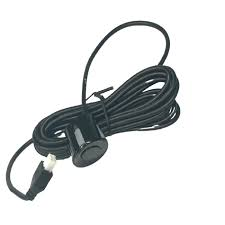
</p>
<p align="center"><b>Fonte: [Autocore Robótica – Módulo Sensor Ultrassônico JSN-SR04T v3.0](https://www.autocorerobotica.com.br/modulo-sensor-ultrassonico-jsn-sr04t-v3-0)</b></p>


A principal característica de um transdutor piezoelétrico é o uso de materiais que apresentam o chamado efeito piezoelétrico, ou seja, a capacidade de converter energia elétrica em energia mecânica (e vice-versa). Em sua construção, o transdutor piezoelétrico se assemelha a um capacitor, pois é formado por duas placas condutoras separadas por um material dielétrico piezoelétrico. Assim como em um capacitor, quando uma tensão é aplicada entre as placas, cria-se um campo elétrico no interior do material, mas, no caso piezoelétrico, isso provoca também uma deformação física do cristal — gerando vibração (onda ultrassônica).

 Da mesma forma, quando o material é submetido a uma pressão mecânica (como uma onda sonora incidente), ele gera uma diferença de potencial elétrico entre as placas. Portanto, além de se comportar eletricamente como um capacitor, o piezoelétrico tem a capacidade adicional de interagir diretamente com sinais acústicos, o que o torna ideal para aplicações em sensores e emissores ultrassônicos. Diante das medições realizadas com um miltímetro foi concluído que a natureza capacitiva do transdutor escolhido é de em torno de 4,7nF.

<p align="center"><b>Figura 2 – Função de transferência do transdutor ultrassônico</b></p>

<p align="center">
  
</p>
<p align="center"><b>Fonte: Aluno</b></p>

Antes de realizar os demais processos de implementação do sistema, foi fundamental caracterizar experimentalmente o transdutor utilizado. Essa etapa inicial garantiu que as próximas fases do projeto — como o desenvolvimento do circuito de transmissão, adaptação dos sinais e implementação da modulação — fossem baseadas em parâmetros reais e compatíveis com o desempenho do componente escolhido.

Logo, com base nos resultados obtidos, concluiu-se que o intervalo de frequência mais interessante para operação situa-se entre 40 kHz e 42 kHz, faixa na qual o transdutor apresentou melhor resposta e maior eficiência para aplicações de modulação M-FSK no contexto do projeto.


### 2. Implementação da Modulação M-FSK no ESP32

O algoritmo de modulação digital foi desenvolvido e implementado no microcontrolador ESP32, utilizando a plataforma Arduino IDE para facilitar o processo de programação e depuração. O sinal M-FSK (Multiple Frequency Shift Keying) foi gerado via modulação por largura de pulso (PWM – Pulse Width Modulation) com frequência variável, controlada pelos temporizadores internos do ESP32. Essa estratégia permitiu flexibilidade na definição da taxa de transmissão, além de garantir um controle preciso das frequências, fundamental para o funcionamento do sistema de comunicação acústica. A seguir é mostrado o código utilizado, assim como sua respectiva explicação.

```cpp
// Definições dos parâmetros PWM
#define PWM_PIN        18      // Pino de saída PWM do ESP32
#define PWM_CHANNEL    0       // Canal PWM (0-15)
#define PWM_RESOLUTION 8       // Resolução do PWM (8 bits)
#define DUTY_CYCLE     127     // Ciclo de trabalho em 8 bits (50%)
#define INTERVALO      100     // Tempo entre trocas de frequência (ms)

int freqA = 40800;             // Primeira frequência (Hz)
int freqB = 41800;             // Segunda frequência (Hz)
int freqAtual = freqA;         // Variável que armazena a frequência atual

unsigned long lastMillis = 0;  // Variável para controle do tempo

void setup() {
  Serial.begin(115200);

  // Configura o canal PWM com a frequência inicial e a resolução definida
  ledcSetup(PWM_CHANNEL, freqAtual, PWM_RESOLUTION);
  ledcAttachPin(PWM_PIN, PWM_CHANNEL);

  // Inicia o PWM com duty cycle de 50%
  ledcWrite(PWM_CHANNEL, DUTY_CYCLE);
}

void loop() {
  unsigned long agora = millis();

  // Verifica se passou o intervalo para trocar a frequência
  if (agora - lastMillis >= INTERVALO) {
    lastMillis = agora;

    // Alterna entre freqA e freqB
    freqAtual = (freqAtual == freqA) ? freqB : freqA;

    // Troca a frequência do canal PWM
    ledcWriteTone(PWM_CHANNEL, freqAtual);
  }
}

```

- O código define os parâmetros do PWM e das frequências a serem alternadas.
- No `setup()`, configura o PWM e o duty cycle.
- No `loop()`, alterna entre duas frequências (40800 Hz e 41800 Hz) usando a função `ledcWriteTone` a cada 100 ms.

O objetivo deste código é realizar a variação automática da frequência do sinal PWM gerado pelo ESP32, alternando entre dois valores distintos em intervalos regulares de tempo. Na prática, essa alternância simula uma modulação FSK (Frequency Shift Keying), técnica amplamente utilizada em sistemas de comunicação digital para representar diferentes símbolos ou bits por meio de diferentes frequências. Dessa forma, o código serve como uma base experimental para testes de modulação FSK, viabilizando a geração de sinais compatíveis com sistemas de comunicação acústica digital utilizando hardware de baixo custo.


### 3. Projeto do Amplificador Classe D e Circuitos de Potência

O amplificador Classe D é um tipo de amplificador de potência que utiliza a operação por chaveamento para converter sinais de entrada analógicos ou digitais em uma forma de onda pulsada, geralmente por meio de modulação por largura de pulso (PWM). Diferente dos amplificadores lineares tradicionais, como os de Classe A, B ou AB, o Classe D alterna rapidamente os transistores de potência entre os estados de corte e saturação, minimizando as perdas de energia por dissipação térmica. Essa característica confere ao amplificador Classe D uma alta eficiência energética, tornando-o especialmente vantajoso para aplicações que exigem potência elevada com baixo consumo, como sistemas de áudio, acionamento de motores e, no contexto deste projeto, a transmissão eficiente de sinais ultrassônicos.

<p align="center"><b>Figura 3 – Etapas de um amplificador classe D</b></p>

<p align="center">
  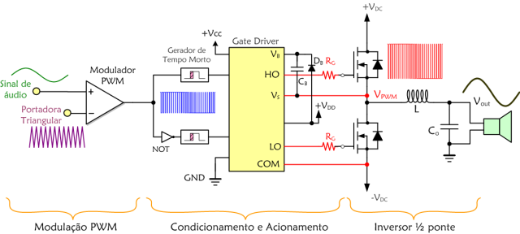
</p>
<p align="center"><b>Fonte: [ELT Geral – Amplificador Classe D: como funciona?](https://eltgeral.com.br/amplificador-classe-d-como-funciona/)</b></p>

### 3.1 Principais etapas do Amplificador Classe D

- Etapa 1: Modulação PWM - O circuito inicia com a modulação por largura de pulso (PWM), onde um sinal de áudio (ou sinal de informação) é comparado com uma portadora triangular de alta frequência. O resultado é um sinal PWM cuja largura dos pulsos varia de acordo com o sinal de entrada.

- Etapa 2: Condicionamento e Acionamento (Gate Driver) - O sinal PWM é enviado para um circuito gerador de tempo morto ("dead time") e, em seguida, para o gate driver (exemplo: IR2110). Esse estágio garante que os MOSFETs do circuito de potência sejam acionados corretamente, evitando curtos-circuitos e promovendo chaveamento rápido e eficiente.

- Etapa 3: Inversor Meia Ponte - No estágio de potência, dois MOSFETs em configuração meia ponte alternam a conexão da carga entre +V<sub>DC</sub> e -V<sub>DC</sub>, formando um sinal PWM de alta potência. Diodos, resistores e capacitores auxiliam no chaveamento seguro e estável.

- Filtro de Saída: O sinal PWM amplificado passa por um filtro LC (indutor e capacitor), que elimina os componentes de alta frequência e recupera o sinal analógico desejado na saída (Vout). Esse sinal pode ser utilizado, por exemplo, para acionar um alto-falante ou transdutor ultrassônico.

### 3.2 Adaptações do amplificador classe D para o projeto

Diferentemente da imagem anterior, durante a realização do projeto foi utilizada diretamente a modulação PWM do ESP32, dispensando assim a necessidade de um estágio de comparação entre uma onda senoidal e uma onda triangular.

Além disso, no projeto, optou-se pela utilização do gate driver IR2110, que exige nível lógico de 10 V para o acionamento correto dos seus terminais de controle. Considerando que o ESP32 opera com sinais de 3,3 V, foi necessário implementar um estágio adicional de adequação de nível utilizando um transistor BJT configurado como chave. Esse estágio tem a função de converter o sinal PWM de 3,3 V fornecido pelo microcontrolador para o nível de 10 V exigido pelo IR2110, assegurando assim a compatibilidade entre os circuitos lógicos e de potência.

Para a construção do circuito meia ponte foram utilizados dois MOSFETs IRF740, sendo a alimentação realizada com tensões entre 12 V e 15 V.

### 4. Filtro de saída sintonizado 

Após a amplificação do sinal, o mesma passa por um filtro LC sintonizado, projetado para maximizar a pureza espectral do sinal transmitido e garantir eficiência na conversão para o meio acústico. O filtro LC é composto por um indutor (L) e um capacitor (C) conectados de forma a criar um circuito ressonante na frequência desejada, funcionando como um seletor de frequência: permite a passagem apenas da faixa de interesse e atenua as demais. O dimensionamento do filtro foi realizado considerando a faixa de operação do transdutor e as limitações de potência dos componentes utilizados, assegurando que o sinal entregue ao transdutor estivesse o mais próximo possível de uma senóide pura também com uma ganho adequado às necessidades do sistema.

<p align="center"><b>Figura 4 – Resposta características de um filtro LC passa faixa </b></p>

<p align="center">
  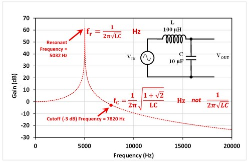
</p>

<p align="center"><b>
Fonte: 
[EEVBlog Forum – Cutoff Frequency for an LC Filter](https://www.eevblog.com/forum/beginners/digikey-and-others-are-incorrect-about-cutoff-frequency-for-an-lc-filter/)
</b></p>

No processo de montagem do filtro LC, foi utilizado um indutor de 1 mH que já estava disponível no laboratório. Inicialmente, ao analisar o circuito composto apenas pelo indutor e pelo transdutor ultrassônico, cuja capacitância aproximada é de 4,7 nF, a frequência de ressonância calculada foi de aproximadamente 73,4 kHz, valor consideravelmente acima da faixa de interesse do projeto. Para corrigir esse desvio e garantir que a ressonância ocorresse em torno de 40 kHz, foi adicionado um capacitor de 10 nF em paralelo ao transdutor, elevando a capacitância total do circuito para aproximadamente 14,7 nF. Com essa configuração, a frequência de ressonância passou a ser aproximadamente 41,5 kHz, conforme previsto na expressão:
$$
f_0 = \frac{1}{2\pi\sqrt{LC}}
$$
onde 
𝐿 é a indutância (1 mH) e 
𝐶 é a capacitância total (14,7 nF). Assim, a associação em paralelo do capacitor adicional ao transdutor permitiu ajustar a frequência do filtro para a faixa desejada, tornando a resposta do circuito compatível com os requisitos do sistema.

<p align="center"><b>Figura 6 – Simulação filtro LC</b></p>

<p align="center">
  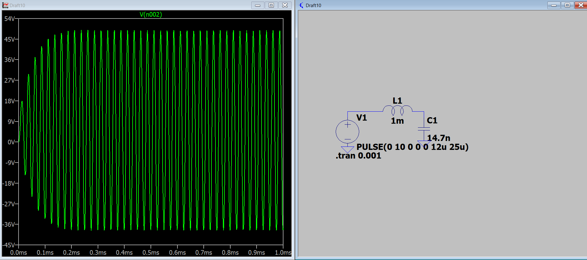
</p>
<p align="center"><b>Fonte: Aluno</b></p>

# RECEPTOR

### 1. Condicionamento do Sinal Recebido

No receptor, o sinal captado pelo transdutor foi inicialmente aplicado a um buffer de entrada, utilizado para realizar o casamento de impedância entre o transdutor e o circuito de amplificação, minimizando perdas e distorções do sinal. O estágio de pré-amplificação foi implementado utilizando amplificadores operacionais ou JFETs, conforme o desempenho obtido em testes experimentais. Em seguida, o sinal passou por um filtro passa-faixa projetado para isolar as frequências de interesse e minimizar interferências externas. A restauração do nível DC do sinal foi realizada para garantir a compatibilidade com a entrada analógica do ESP32. 

#### 1.1 Controle de ganho automático 

Além da etapa anterior na recepção, ainda será implementado um sistema de controle automático de ganho (AGC) na recepção do sinal, com o objetivo de manter o sinal dentro da faixa ideal para conversão analógico-digital pelo ESP32, independentemente das variações na intensidade do sinal recebido. O AGC monitora continuamente o nível de saída do sinal após a amplificação e ajusta dinamicamente o ganho do circuito, de modo a evitar tanto a saturação quanto a presença de sinais muito fracos, que comprometeriam a resolução do ADC.

Para implementar o sistema de controle automático de ganho (AGC), a proposta consiste em utilizar um potenciômetro digital inserido na realimentação de um amplificador operacional. Essa abordagem permite o ajuste dinâmico do ganho do amplificador por meio do controle digital do potenciômetro, facilitando a automação do processo de adaptação do nível do sinal à entrada do ADC do ESP32. Dessa forma, é possível monitorar o nível do sinal de saída e, conforme necessário, variar a resistência de realimentação do amplificador para aumentar ou reduzir o ganho, mantendo o sinal sempre dentro da faixa ideal para conversão analógico-digital. Esta solução oferece precisão, praticidade e possibilidade de integração com o microcontrolador, permitindo ajustes automáticos em tempo real conforme as condições do ambiente ou da transmissão variem.

O potenciômetro digital utilizado para realizar o controle de ganho no circuito foi o X9C104. Esse componente permite substituir o potenciômetro mecânico tradicional por uma solução controlada eletronicamente, facilitando o ajuste automático do ganho do amplificador operacional. O X9C104 possui resistência nominal de 100 kΩ, dividida em 100 passos discretos, e seu valor pode ser ajustado digitalmente através de sinais de controle enviados pelo microcontrolador. O funcionamento do X9C104 baseia-se em três pinos principais: INC (Increment), que recebe pulsos para alterar a resistência; UD (Up/Down), que determina se a resistência será aumentada ou diminuída; e CS (Chip Select), que habilita o dispositivo para receber comandos. 

O ajuste do cursor é feito entre os terminais A e B, variando o valor lido no terminal W (wiper), exatamente como em um potenciômetro convencional. Essa configuração permite ao microcontrolador monitorar o nível do sinal e ajustar o ganho do amplificador operacional em tempo real, tornando o sistema de AGC mais preciso, prático e totalmente automatizado.

<p align="center"><b>Figura 4 – Potenciômetro Digital </b></p>

<p align="center">
  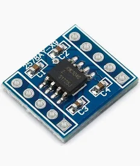
</p>

<p align="center"><b>
Fontes: <br>
[AliExpress – Potenciômetro Digital X9C104](https://pt.aliexpress.com/item/1005008176591028.html)
</b></p>

### 2. Amostragem e Demodulação Digital

A taxa máxima de amostragem do ADC do ESP32-S3 é de 80 kHz, o que limita a aplicação direta do critério de Nyquist para sinais na faixa de 40 kHz a 42 kHz, já que o ideal seria uma taxa de amostragem superior ao dobro da frequência máxima do sinal. Diante dessa limitação, torna-se necessário utilizar a técnica de subamostragem (ou amostragem em banda passante), que permite adquirir sinais de alta frequência desde que estejam restritos a uma faixa específica do espectro e sejam tomadas precauções para evitar aliasing. O sinal condicionado será então adquirido pelo ADC e, para a demodulação digital, serão avaliadas e implementadas diferentes técnicas, como filtros digitais, algoritmo de Goertzel e FFT, buscando a extração eficiente das informações transmitidas e a minimização do erro de detecção.

### 2.1 Subamostragem

A subamostragem, também chamada de amostragem em banda passante (ou “undersampling”, em inglês), é uma técnica utilizada para adquirir sinais analógicos de frequência elevada com taxas de amostragem inferiores àquelas recomendadas pelo critério de Nyquist para sinais em banda base. De acordo com o teorema de Nyquist-Shannon, para evitar aliasing, a frequência de amostragem deve ser, no mínimo, o dobro da maior frequência presente no sinal. No entanto, quando o sinal de interesse está confinado a uma banda de frequências superior (por exemplo, entre 40 kHz e 42 kHz), e não desde o zero até a frequência máxima, a subamostragem pode ser empregada de forma segura e eficiente.

Ao utilizar a subamostragem, o sinal em banda passante é intencionalmente amostrado com uma frequência menor que o dobro da frequência máxima, desde que a largura da banda de interesse seja menor que metade da frequência de amostragem. Neste caso, o espectro do sinal é transladado para uma faixa mais baixa no domínio digital, sem sobreposição indesejada das bandas (aliasing), desde que alguns critérios sejam respeitados:

- A largura da banda do sinal (BW) deve ser menor do que metade da frequência de amostragem (𝐵𝑊<𝑓𝑠/2), onde fs é a frequência de amostragem.

- O espectro do sinal deve estar suficientemente afastado da origem (ou seja, ser um sinal em banda passante) para evitar que, ao ser transladado pelo processo de amostragem, ocorra sobreposição com outras réplicas espectrais.

- Filtros analógicos antes do ADC são essenciais para remover componentes fora da banda de interesse, evitando aliasing de frequências não desejadas.

- A frequência central do sinal e a frequência de amostragem devem ser escolhidas de forma que, após a amostragem, a banda de interesse seja posicionada corretamente no espectro digital, permitindo sua posterior detecção por algoritmos digitais.

<p align="center"><b>Figura 4 – Espectro subamostrado </b></p>

<p align="center">
  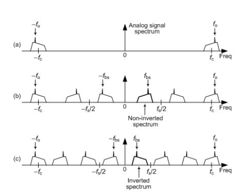
</p>

<p align="center"><b>
Fontes: Desconhecida
</b></p>

O critério fundamental para recuperar corretamente o espectro de um sinal após a subamostragem é garantir que a largura de banda do sinal seja menor que metade da frequência de amostragem (BW < fs/2) e que a frequência de amostragem escolhida seja maior que o dobro da largura de banda (fs > 2·BW), evitando assim a sobreposição (aliasing) entre as réplicas espectrais. Ao amostrar um sinal que ocupa uma faixa de frequências altas, como por exemplo de 40 kHz a 42 kHz, com uma frequência de amostragem de 12 kHz, o espectro desse sinal é transladado para uma faixa inferior no domínio digital. Nesse caso, a largura de banda de interesse é de 2 kHz, o que satisfaz o critério de 2·BW = 4 kHz < fs = 12 kHz.

Após a subamostragem, a banda original de 40 kHz a 42 kHz aparece, no espectro amostrado, entre 4 kHz e 6 kHz. Isso ocorre porque a diferença entre a frequência do sinal e o múltiplo inteiro mais próximo da frequência de amostragem determina onde o espectro vai “aterrar” no domínio digital. Portanto, mesmo com uma taxa de amostragem muito inferior à frequência central do sinal, desde que os critérios de banda sejam atendidos e que o sinal de entrada seja adequadamente filtrado para evitar componentes indesejados, a subamostragem permite processar sinais de alta frequência com recursos de hardware limitados. Dessa forma, sinais que originalmente estavam em torno de 40 kHz a 42 kHz podem ser digitalizados e analisados digitalmente como se estivessem em frequências muito mais baixas.

Dentro do microcontrolador, são utilizados filtros digitais para processar os sinais adquiridos pelo ADC. Esses filtros são aplicados sobre os dados armazenados em buffers, permitindo isolar as componentes de frequência de interesse mesmo após a subamostragem. Após o processo de filtragem, o microcontrolador calcula a energia resultante de cada banda filtrada, facilitando a identificação das frequências presentes no sinal recebido. Essa análise da energia em cada faixa é fundamental para a demodulação do sinal e para a extração eficiente das informações transmitidas, tornando o sistema robusto mesmo diante de ruídos e interferências no ambiente subaquático.

### 7. Integração e Prototipagem

Todos os blocos serão inicialmente montados e testados em protoboard, permitindo ajustes rápidos e validação funcional. Após a verificação individual das etapas, será desenvolvida uma placa de circuito impresso (PCI) para integração do sistema de forma compacta e robusta.

### 8. Testes Experimentais e Validação

Os testes de comunicação serão realizados em ambiente controlado, com alcance inicial de pelo menos 5 metros, podendo ser ampliados conforme o desempenho observado. O sistema será avaliado quanto à taxa de transmissão, estabilidade do enlace e robustez frente a ruídos e interferências típicas do ambiente subaquático.


## Resultados

[Incluir e comentar sobre: Diagrama final do protótipo, descrição dos testes realizados, apresentação e análise dos resultados dos testes realizados, fotos, diagramas, tabelas comparativas.]

## Transmissão

Para avaliar e validar o circuito de transmissão de dados, o sistema foi inicialmente montado em protoboard e submetido a diversos testes, permitindo uma análise criteriosa de seu desempenho. O principal objetivo dessa etapa foi verificar se o circuito seria capaz de gerar ondas senoidais com o maior grau de pureza possível, condição essencial para garantir a eficiência e a qualidade da comunicação acústica proposta no projeto.


<p align="center"><b>Figura 4 – Transmissor montado em portoboard </b></p>

<p align="center">
  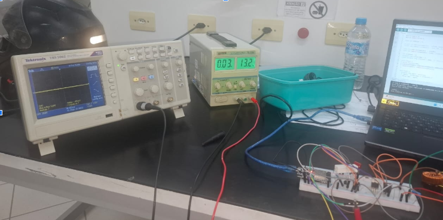
</p>

<p align="center"><b>
Fontes: Aluno
</b></p>


Após os testes a proposta de circuito transmissor demonstrou excelente desempenho na produção de um sinal senoidal a partir de uma onda quadrada. Combinando o código implementado no ESP32 e o circuito projetado, foi possível transformar o sinal PWM originalmente quadrado em uma onda senoidal com resposta de transição bastante satisfatória. Além disso, o sistema permitiu a geração estável de frequências abaixo de 50 kHz, superando as necessidades do projeto e proporcionando flexibilidade para diferentes aplicações de comunicação acústica.

<p align="center">
  <span style="display:inline-block; width:250px; text-align:center;">
    <b>Figura 1 – Legenda da primeira imagem</b>
  </span>
  <span style="display:inline-block; width:190px; text-align:center;">
    <b>Figura 2 – Legenda da segunda imagem</b>
  </span>
</p>
<p align="center">
  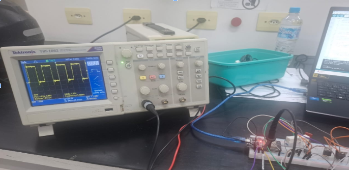
  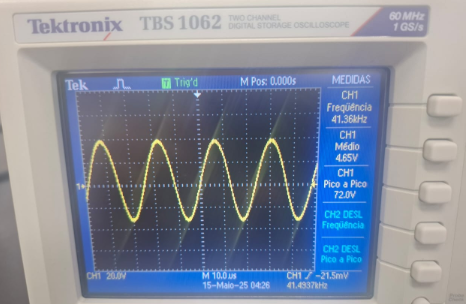
</p>
<p align="center"><b>Fonte: Autor</b></p>
Diante dos dados obtidos, é perceptível que a forma de onda resultante é praticamente senoidal, com a ressalva de que nos vales a curva apresenta-se um pouco mais achatada do que nos picos. Além disso, observa-se um ganho considerável na amplitude da tensão: partindo de uma onda quadrada de 10 V de pico , foi possível, em algumas frequências, obter uma senóide de até 72 V pico a pico.

Após essa etapa, foi desenvolvida uma placa de circuito impresso (PCI) caseira, confeccionada a partir da impressão do layout do circuito em uma impressora a laser utilizando papel fotográfico. O papel, ao ser aquecido contra uma placa de cobre, transfere o conteúdo da tinta para o cobre, que posteriormente é imerso em percloreto de ferro. Esse processo químico corrói o cobre não protegido pela tinta, formando as trilhas do circuito e resultando na placa de circuito impresso utilizada nos testes finais.

<p align="center"><b>Figura 4 – Layout da placa de circuito impresso </b></p>

<p align="center">
  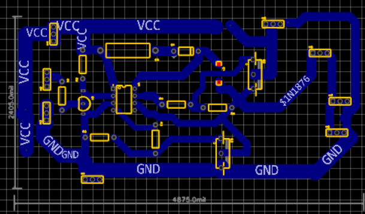
</p>

<p align="center"><b>
Fontes: Autor
</b></p>

<p align="center">
  <span style="display:inline-block; width:250px; text-align:center;">
    <b>Figura 1 – Placa circuito impresso - Vista superior</b>
  </span>
  <span style="display:inline-block; width:190px; text-align:center;">
    <b>Figura 2 – Placa circuito impresso - Vista inferior /b>
  </span>
</p>
<p align="center">
  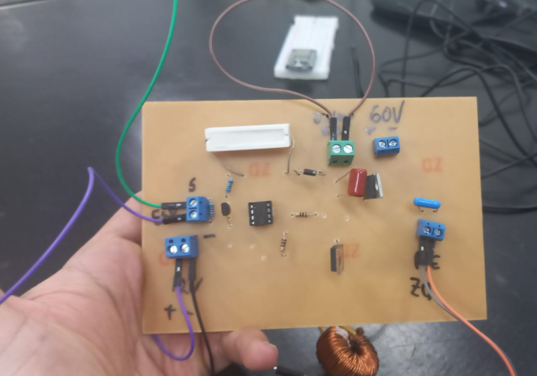
  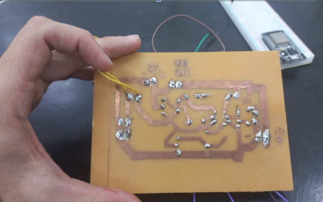
</p>
<p align="center"><b>Fonte: Autor</b></p>

# Recepção


Para a avaliação e validação da etapa de recepção, foi utilizado um grande recipiente contendo água, no qual os transdutores de envio e recepção foram submersos de modo a ficarem totalmente cobertos. Os transdutores foram posicionados a uma distância aproximada de 10 cm entre si, conforme ilustrado abaixo. Essa configuração permitiu realizar testes controlados das etapas de transmissão e recepção do sistema em um ambiente aquático, garantindo condições adequadas para análise do desempenho do modem acústico desenvolvido.

<p align="center"><b>Figura: Ambiente de Testes</b></p>


  </span>
</p>
<p align="center">
  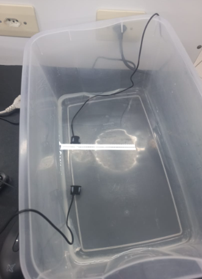
  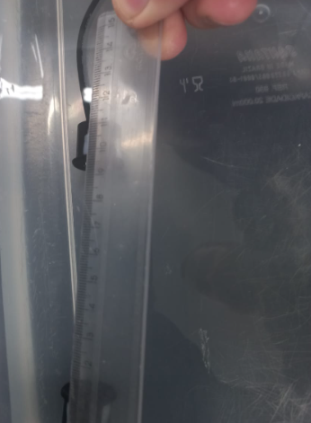
</p>
<p align="center"><b>Fonte: Autor</b></p>

Com o ambiente de testes montado, foi possível iniciar os experimentos de recepção. Durante esses testes, observou-se que a etapa de filtragem, independente da topologai de filtro passa faixa, introduzia uma distorção significativa no sinal recebido. Uma possível causa para esse comportamento pode estar relacionada ao slew rate do amplificador operacional utilizado, pois, nas regiões onde a curva senoidal apresenta maiores variações, surgem picos triangulares característicos de limitação de taxa de variação. Esse efeito é típico quando o slew rate do amplificador não é suficiente para acompanhar as rápidas mudanças do sinal, comprometendo a fidelidade da forma de onda recebida.

<p align="center"><b>Figura 4 –Sinal distorcido </b></p>

<p align="center">
  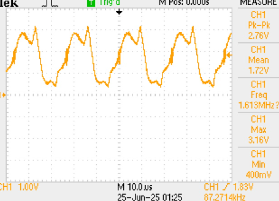
</p>

<p align="center"><b>
Fontes: Autor
</b></p>

Diante dos resultados insatisfatórios, optou-se por simplificar ainda mais o circuito, removendo a etapa de filtragem e mantendo apenas uma etapa de amplificação de ganho, utilizando o amplificador operacional na configuração inversora. No entanto, mesmo com essa modificação, não foi possível alcançar uma qualidade de sinal satisfatória na recepção, indicando que outros fatores limitantes podem estar presentes no sistema.

<p align="center"><b>Figura - Sinais obtidos com circuito simplificado</b></p>

  </span>
</p>
<p align="center">
  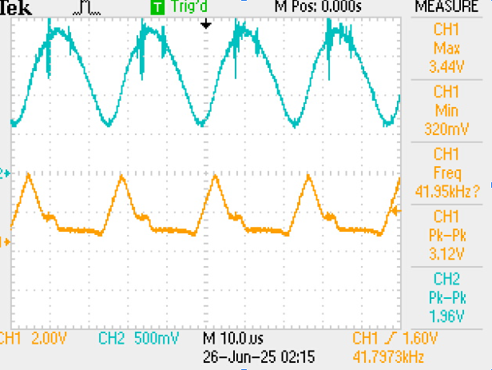
  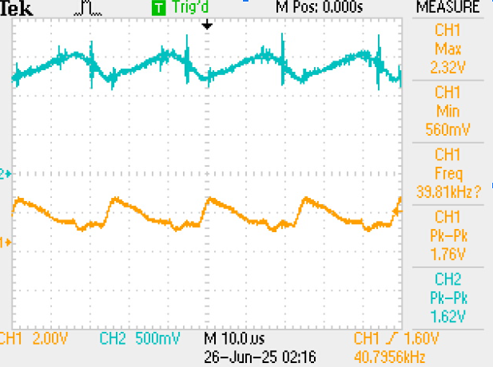
</p>
<p align="center"><b>Fonte: Autor</b></p>

Nesses últimos testes, é possível observar uma grande distorção do sinal após o condicionamento (em laranja) em comparação ao sinal recebido diretamente do transdutor (em verde/ciano). Apesar dessa distorção significativa introduzida pelo circuito de condicionamento, em todos os casos foi verificada a manutenção do pico de frequência original, o que pôde ser confirmado por meio da análise das transformadas rápidas de Fourier (FFT) aplicadas aos sinais obtidos.

<p align="center"><b>Figura - Sinais obtidos com circuito simplificado</b></p>

  </span>
</p>
<p align="center">
  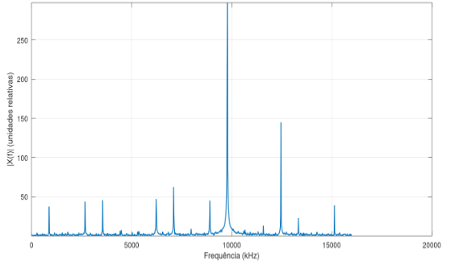
  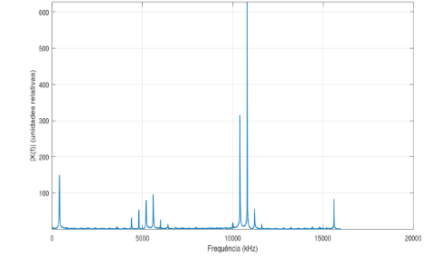
</p>
<p align="center"><b>Fonte: Autor</b></p>

Antes da análise das transformadas de Fourier obtidas a partir dos sinais adquiridos pelo ESP32-S3, é importante ressaltar que foi utilizada a técnica de subamostragem com taxa de 30 kHz. As frequências originais dos sinais analisados eram de 40,8 kHz e 41,8 kHz, respectivamente. Com esse processo de aquisição, essas frequências são transladadas para 9,8 kHz e 10,8 kHz no domínio digital. Dessa forma, mesmo que o sinal adquirido apresente significativa deformação, ainda é possível identificar claramente a frequência transmitida por meio da análise espectral. Isso comprova que, apesar das distorções, o sistema é capaz de distinguir qual frequência — e, portanto, qual bit — está sendo enviado.

Então, para dar continuidade à validação da comunicação, a etapa seguinte consistiu no dimensionamento de filtros digitais capazes de isolar as frequências mais expressivas do sinal para a demodulação, ou seja, a identificação da frequência ressonante. Esses filtros foram projetados para atuar especificamente nas bandas correspondentes às frequências resultantes do processo de subamostragem, facilitando a detecção precisa dos bits transmitidos, mesmo na presença de ruídos ou distorções.

Então para o dimensionamento dos filtros, foi utilizado o softwate Octave para compreender quais as caracter´sitcas deste filtro, diante dos testes realziados com os dados adquie=ridos, foi escolhido a topologia butterwaolf 

# Conclusão

### Dificuldades encontradas

[Apresente as dificuldades encontradas durante ao longo do desenvolvimento do seu trabalho.]

### Sugestões para trabalhos futuros

[Apresente suas sugestões de trabalhos futuros.]

## Referências

- INDRIYANTO, Slamet; EDWARD, Ian Yosef Matheus. Ultrasonic Underwater Acoustic Modem Using Frequency Shift Keying (FSK) Modulation. 2018. Disponível em: <https://ieeexplore.ieee.org/document/8530540>. Acesso em: 25 jun. 2025.

- SU, Yishan et al. An general embedded underwater acoustic communication system based on advance STM32. IEEE Embedded Systems Letters, 2020. Disponível em: <https://ieeexplore.ieee.org/document/9148756>. Acesso em: 25 jun. 2025.

- COCCOLO, Emanuele et al. Underwater Acoustic Modem for a MOrphing Distributed Autonomous Underwater Vehicle (MODA). OCEANS 2022, Hampton Roads, VA, USA, 2022.

- LEE, Wonwoo; JEON, Jun-Ho; PARK, Sung-Joon. Micro-modem for short-range underwater communication systems. 2014. Disponível em: <https://ieeexplore.ieee.org/document/7003122>. Acesso em: 25 jun. 2025.

- SHERLOCK, Benjamin et al. Ultra-Low-Cost and Ultra-Low-Power, Miniature Acoustic Modems Using Multipath Tolerant Spread-Spectrum Techniques. Electronics, v. 11, n. 9, p. 1446, 2022.

- CAMPAGNARO, Filippo et al. Affordable underwater acoustic modems and their application in everyday life: a complete overview. In: The 17th International Conference on Underwater Networks & Systems (WUWNet’23), Shenzhen, China, 2023.

- CHEN, Hongbin et al. Underwater Acoustic Micromodem for Underwater Internet of Things. Wireless Communications and Mobile Computing, v. 2022, 2022.

- RENNER, Bernd-Christian; HEITMANN, Jan; STEINMETZ, Fabian. ahoi: Inexpensive, Low-power Communication and Localization for Underwater Sensor Networks and μAUVs. ACM Transactions on Sensor Networks, v. 16, n. 2, p. 1-46, 2020.
